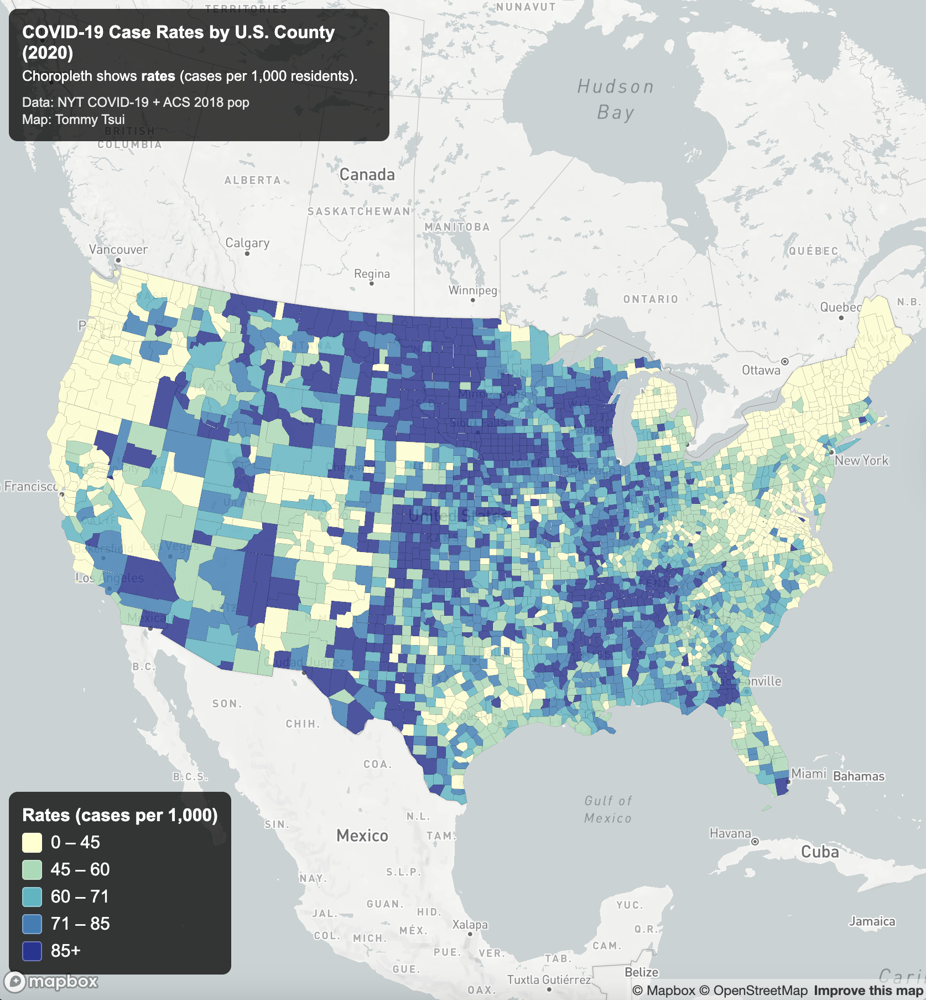
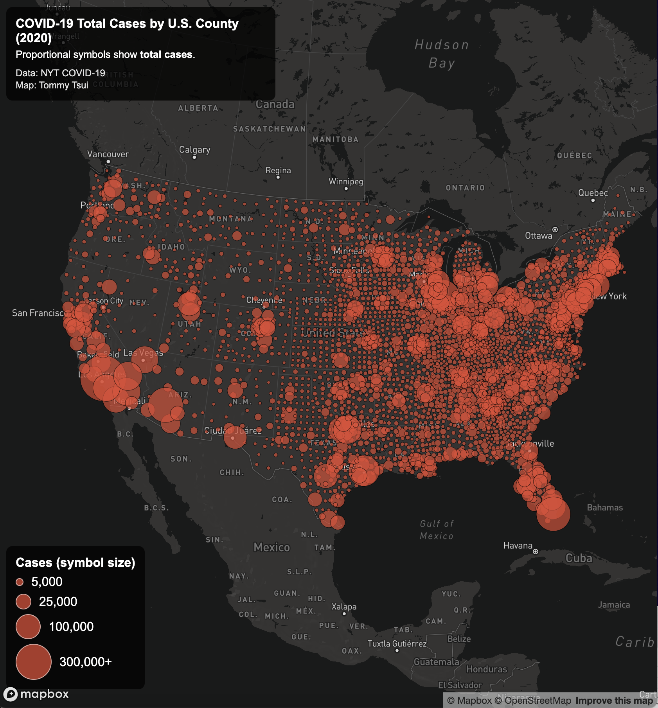

# COVID-19 County-Level Web Maps (2020)

This project visualizes county-level COVID-19 data in the United States using interactive web maps built with Mapbox GL JS. Two thematic maps were created to explore different representations of the same dataset, a choropleth map of infection rates and a proportional symbol map of total case counts.

The goal of this project is to demonstrate web mapping techniques including GeoJSON data integration, map projection handling, interactive popups, legends, and responsive map layouts.

---

## Link to the Maps

**Choropleth Map**  
https://ttsui123.github.io/ttsui123.us-covid-2020-webmaps/map1.html  

**Proportional Symbol Map**  
https://ttsui123.github.io/ttsui123.us-covid-2020-webmaps/map2.html  

---

## Screenshots

### Choropleth Map (COVID-19 Rates)

### Proportional Symbol Map (COVID-19 Cases)

---

## Map Features

### Choropleth Map

- Displays COVID-19 infection rates per 1,000 residents by county
- Uses a five-class stepped color scheme
- Interactive click popups showing:
  - County name
  - Case rate
  - Total cases
  - Total deaths
- Hover cursor feedback
- Albers Equal Area projection applied for improved national-scale visualization
- Custom legend and title overlay

---

### Proportional Symbol Map

- Displays total COVID-19 case counts using centroid-based proportional circles
- Circle sizes scale dynamically based on case totals
- Interactive popups showing:
  - County name
  - Total cases
  - Total deaths
- Hover interaction feedback
- Albers Equal Area projection applied
- Custom proportional symbol legend and title overlay

---

## Technical Implementation

### Libraries and Tools Used

- **Mapbox GL JS** — Interactive web mapping framework  
- **Mapshaper.org** — GeoJSON conversion, geometry simplification, centroid generation  
- **GitHub Pages** — Web hosting  
- **VS Code Live Server** — Local development server  

---

### Data Processing Steps

1. Original shapefiles were converted to GeoJSON format using Mapshaper.
2. Geometry simplification was applied to improve performance.
3. Unnecessary attribute fields were removed.
4. County centroid points were generated for the proportional symbol map.
5. Data was served locally using a development server to avoid CORS restrictions.

---

## Data Sources

- **COVID-19 Case and Death Data:**  
  The New York Times COVID-19 Data Repository  

- **Population Data:**  
  American Community Survey (ACS) 2018 5-Year Estimates  

- **County Boundary Data:**  
  U.S. Census Bureau Cartographic Boundary Files  

---

## Projection

Both maps use the Albers Equal Area projection, which is commonly applied for continental United States thematic mapping to reduce area distortion and improve spatial accuracy for national-scale visualization.

---

## Author

**Tommy Tsui**  
University of Washington  
GEOG 458 

---

## Acknowledgments

This project was completed as part of the University of Washington Geography Department. 